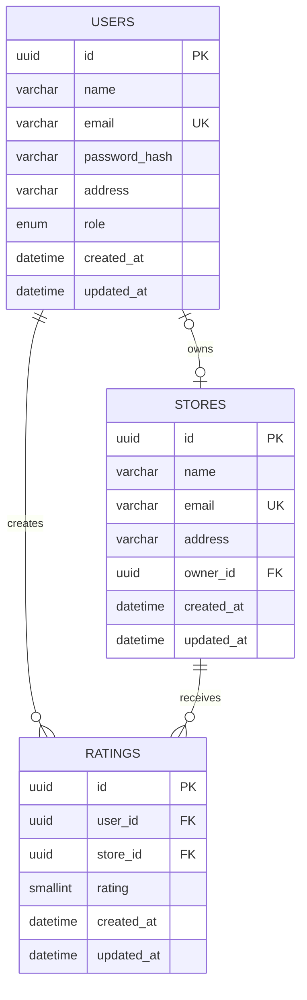

# REVORA — Discover. Rate. Trust.

REVORA is a responsive store-rating platform with three roles:

- **Admin** — manage people and places, connect store owners, and see platform stats.
- **Member** — discover stores, search by place/address, and submit or update 1–5 star ratings.
- **Store owner** — see the average rating and the people who rated connected stores.

REVORA is built with React and Vite on the frontend, an Express REST API, a Prisma PostgreSQL schema, JWT authentication with bcrypt password hashing, Zod schema validation, role-based access control, server-side sorting and pagination, and an editorial dashboard interface.

## Run locally

```bash
npm install
npm run build
npm start
```

Then open [http://localhost:3000](http://localhost:3000).

For local PostgreSQL:

```bash
cp .env.example .env
npm run prisma:generate
npm run prisma:migrate
npm run prisma:seed
```

Or start the database with:

```bash
docker compose up -d postgres
```

The application uses an in-memory repository fallback for quick local development when `DATABASE_URL` is not configured. This enables immediate testing while keeping `backend/prisma/schema.prisma`, migrations, seed scripts, and Docker Compose ready for PostgreSQL-backed deployment.

## Demo credentials

| Role | Email | Password |
| --- | --- | --- |
| Admin | `admin@revora.app` | `Admin!234` |
| Member | `nora@revora.app` | `User!2345` |
| Store owner | `owner@revora.app` | `Owner!234` |

The public signup flow always creates a normal `USER`; roles cannot be escalated from the browser.

## Environment

Copy `.env.example` to `.env` when running with a real database:

| Variable | Purpose |
| --- | --- |
| `PORT` | HTTP port; defaults to `3000`. |
| `JWT_SECRET` | Signing secret for access tokens. |
| `DATABASE_URL` | PostgreSQL connection string consumed by Prisma. |
| `CORS_ORIGIN` | Allowed browser origin; defaults to the request origin in local development. |

## API

All application endpoints are under `/api` and return a consistent `{ success, message, errors }` envelope.

| Method | Path | Access | Purpose |
| --- | --- | --- | --- |
| GET | `/api/health` | Public | Runtime health check. |
| POST | `/api/auth/signup` | Public | Create a normal member account. |
| POST | `/api/auth/login` | Public | Return JWT access token and user. |
| PUT | `/api/auth/password` | Authenticated | Change password with old/new password. |
| GET | `/api/admin/stats` | Admin | Total users, stores, and ratings. |
| GET | `/api/admin/users` | Admin | Filtered/sorted/paginated people list. |
| GET | `/api/admin/users/:id` | Admin | User detail and store-owner average. |
| POST | `/api/admin/users` | Admin | Create admin, member, or store owner. |
| GET | `/api/admin/stores` | Admin | Filtered/sorted/paginated stores with average. |
| POST | `/api/admin/stores` | Admin | Add a store and optionally connect an owner. |
| GET | `/api/stores` | Member | Search/sort stores with `avgRating` and `myRating`. |
| POST | `/api/stores/:id/ratings` | Member | Submit or upsert a rating. |
| PUT | `/api/stores/:id/ratings` | Member | Modify a rating. |
| GET | `/api/owner/dashboard` | Store owner | Average rating and rater list. |

Sorting is whitelist-based. Supported list endpoints accept `page` and `limit` even when the UI does not need pagination yet.

## Data model



Each `(user_id, store_id)` pair is unique. A rating is updated when the member rates the same store again, and averages are calculated from rating rows rather than stored aggregates.

## Validation and security

- User names: 20–60 characters.
- Addresses: at most 400 characters.
- Passwords: 8–16 characters, at least one uppercase letter and one special character.
- Ratings: integer 1–5.
- bcrypt password hashing, JWT authentication, Helmet, CORS, rate limiting, Zod request validation, centralized errors, forced signup role, and server-side authorization.
- No password hash is returned by any API response.

## Project map

- `frontend/src/App.jsx` — route tree and role-specific pages.
- `frontend/src/components.jsx` — shell, tables, filters, stars, stats, forms, toasts.
- `frontend/src/context/AuthContext.jsx` — JWT session persistence and 401 logout.
- `backend/src/app.js` — Express API, middleware, route handlers, static serving.
- `backend/src/utils/data.js` — seeded demo repository and computed rating helpers.
- `backend/prisma/schema.prisma` — production PostgreSQL data model.
- `tests/api.test.js` — critical auth, role, rating, and average tests.

## Checks

```bash
npm run build
npm test
npm run lint
```

In production mode, the Express server serves both the compiled frontend static files and the API from the configured `PORT`.
