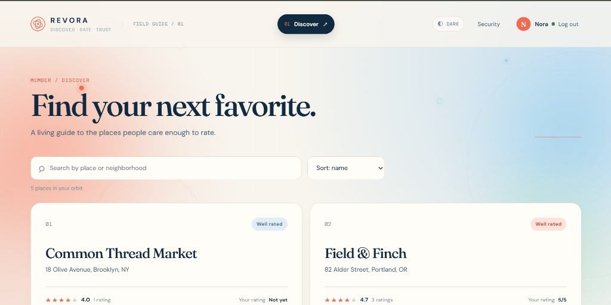
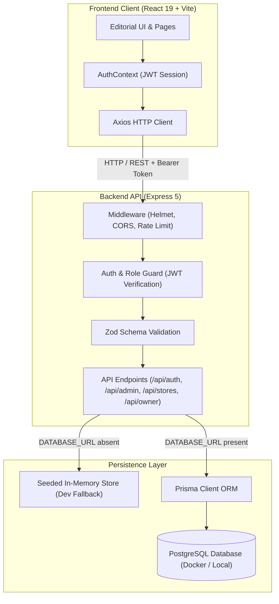

# REVORA — Discover. Rate. Trust.

<p align="center">
  
</p>

[](https://react.dev/)
[](https://nodejs.org/)
[](https://expressjs.com/)
[](https://www.prisma.io/)
[](https://www.postgresql.org/)
[](https://vitejs.dev/)
[](tests/api.test.js)
[](LICENSE)

---

## One-line Value Proposition

> **A curated, editorial-grade store rating platform empowering conscious consumers to discover authentic local places and share verified, considered feedback.**

---

## Demo / Screenshots / Video



*Figure 1: REVORA Member Discovery Feed featuring live place search, score sorting, real-time 1–5 star interactive ratings, and ambient theme toggle.*

---

## Overview

**REVORA** is a responsive, full-stack store discovery and rating platform built with modern web standards and an editorial design aesthetic. The platform provides dedicated, role-governed workflows for three core personas:

- 🛡️ **Platform Administrator**: Oversees platform integrity, manages registered members, provisions store owners, curates places, and tracks community metrics.
- 🧭 **Community Member**: Discovers independent businesses, searches by locality or name, and submits or updates interactive 1–5 star ratings.
- 🏪 **Store Owner**: Monitors community sentiment in real time, tracking the store's average signal, rating trajectory, and feedback from verified patrons.

The system features dual-mode persistence: a zero-configuration seeded in-memory store for instant local exploration, alongside a full Prisma ORM schema with PostgreSQL migrations for production deployment.

---

## Problem Statement

Traditional consumer review platforms are frequently undermined by several critical flaws:

1. **Review Manipulation & Duplicate Skew**: Without strict identity constraints, individual users can submit repetitive reviews or artificially alter aggregate scores.
2. **Cluttered, Ad-Heavy Interfaces**: Existing directories prioritize sponsored placements over authentic community recommendations.
3. **Privilege Escalation Risks**: Lack of robust server-side role validation allows malicious actors to escalate privileges or claim unauthorized business accounts.
4. **Heavy Setup Friction for Developers**: Many full-stack prototypes require complex database containers or external cloud accounts just to run a quick local demonstration.

---

## Solution

REVORA addresses these challenges through a thoughtfully engineered architecture:

- **Strict Relational Uniqueness**: Implements a compound unique constraint on `(userId, storeId)`. Each member may rate a store exactly once; subsequent submissions dynamically update their existing rating rather than inflating counts.
- **Server-Side Arithmetic Averaging**: Calculates average scores dynamically from active rating rows (`Math.round((sum / count) * 10) / 10`) rather than relying on stale cached counters.
- **Enforced Role-Based Access Control**: Centralized JWT authorization middleware blocks privilege escalation at the API boundary, guaranteeing public signups are strictly mapped to normal members (`USER`).
- **Zero-Dependency Quickstart**: Operates out of the box with an in-memory repository fallback, seamlessly switching to PostgreSQL when `DATABASE_URL` is provided.

---

## Key Features

- **Multi-Role RBAC**: Strict separation of capabilities across `ADMIN`, `USER`, and `STORE_OWNER` roles.
- **Live Search & Multidimensional Sorting**: Filter places by name or address, and sort dynamically by alphabetical order, average score, or review volume.
- **Interactive 1–5 Star Rating Engine**: Instant client-side star ratings with optimistic feedback and backend upsert logic.
- **Store Owner Pulse Dashboard**: Real-time signal metrics displaying average ratings, review count, and a chronological patron review feed.
- **Administrative Governance Suite**: Tools to create and edit user profiles, assign store ownership, curate places, and view aggregate platform health metrics.
- **Dark / Light Mode Switching**: Persistent theme preference stored locally with curated color palettes (Fraunces & DM Sans typography, soft ambient background glows).
- **Zod Input Validation**: Robust client and server validation enforcing character limits (names 20–60 chars, addresses ≤400 chars, passwords 8–16 chars with uppercase and special character requirements).
- **Security Best Practices**: Bcrypt password hashing (10 salt rounds), Helmet security headers, CORS origin enforcement, and Express rate limiting.

---

## System Architecture



---

## How It Works

### 1. Authentication & Security
- Public registration routes (`/api/auth/signup`) explicitly enforce the `USER` role; browser payloads cannot escalate permissions.
- Logins issue a signed JWT access token (`7d` validity) incorporating user ID and role claims.
- The React client stores the token in `localStorage` and automatically attaches an `Authorization: Bearer <token>` header to all outgoing requests.
- Automatic 401 interceptors purge expired sessions and redirect the browser to `/login`.

### 2. Rating & Score Computation
```
Average Score = Math.round(( ∑ Ratings / N ) * 10) / 10
```
- When a user rates a place, REVORA checks for an existing record matching `(userId, storeId)`.
- If found, the existing score is updated and `updatedAt` is refreshed. If not, a new rating record is inserted.
- Both the store's global `avgRating` and the authenticated member's `myRating` are computed and returned in discovery responses.

### 3. Role-Based Navigation
- **Admin**: Routes to `/admin`, `/admin/users`, and `/admin/stores` for systemic management.
- **Member**: Routes to `/stores` to discover independent businesses and record ratings.
- **Store Owner**: Routes to `/owner` to view store performance metrics and patron rating feeds.

---

## Tech Stack

| Category | Technology | Purpose |
|---|---|---|
| **Frontend Framework** | [React 19](https://react.dev/) | Component architecture, hooks, and reactive UI state |
| **Build Tooling** | [Vite 7](https://vitejs.dev/) | Fast HMR development server and optimized rollup production bundling |
| **Routing** | [React Router 7](https://reactrouter.com/) | Client-side declarative routing and role-based route guards |
| **Form Handling** | [React Hook Form](https://react-hook-form.com/) | High-performance, lightweight form state management |
| **HTTP Client** | [Axios](https://axios-http.com/) | Request/response interceptors and unified error extraction |
| **Styling** | Vanilla CSS3 | Custom design system, responsive grids, and dark/light themes |
| **Backend Runtime** | [Node.js](https://nodejs.org/) (ESM) | Asynchronous JavaScript runtime environment |
| **Web Server** | [Express 5](https://expressjs.com/) | High-performance RESTful API framework |
| **Data Validation** | [Zod](https://zod.dev/) | Type-safe schema validation for user, store, and rating payloads |
| **Database ORM** | [Prisma 6](https://www.prisma.io/) | Next-generation ORM and PostgreSQL schema migrations |
| **Database** | [PostgreSQL 16](https://www.postgresql.org/) | ACID-compliant relational persistence |
| **Containerization** | [Docker Compose](https://www.docker.com/) | Isolated multi-container service orchestration |
| **Testing** | Node.js Test Runner (`node --test`) | Built-in zero-dependency unit and integration testing |

---

## Project Structure

```
revora/
├── backend/
│   ├── prisma/
│   │   ├── migrations/             # SQL schema migrations
│   │   ├── schema.prisma           # Prisma schema definition
│   │   └── seed.ts                 # Database seed script
│   └── src/
│       ├── utils/
│       │   └── data.js             # In-memory repository & rating helper algorithms
│       ├── app.js                  # Express application, routes, and error handling
│       └── server.js               # HTTP server entry point (port 3000)
├── frontend/
│   ├── public/                     # Static public assets
│   ├── src/
│   │   ├── api/
│   │   │   └── client.js           # Axios instance with auth interceptors
│   │   ├── context/
│   │   │   └── AuthContext.jsx     # Global authentication provider
│   │   ├── styles/
│   │   │   └── index.css           # Global typography, themes, and design tokens
│   │   ├── App.jsx                 # Route definitions and page views
│   │   ├── components.jsx          # Reusable UI components (Shell, Tables, Stars, Cards)
│   │   └── main.jsx                # React DOM entry point
│   ├── index.html                  # Main HTML template
│   └── vite.config.js              # Vite configuration and API proxy
├── docs/
│   └── screenshots/                # Documentation screenshots
│       └── revora-discover-demo.png
├── tests/
│   └── api.test.js                 # Integration test suite (Auth, RBAC, Ratings)
├── docker-compose.yml              # PostgreSQL Docker Compose service
├── Dockerfile                      # Production container image definition
├── package.json                    # Project dependencies and script definitions
└── README.md                       # Project documentation
```

---

## Installation

### Prerequisites
- **Node.js**: v18.0.0 or higher (v20+ recommended)
- **npm**: v9.0.0 or higher
- **Docker** *(Optional, for PostgreSQL database)*

### Quickstart

1. **Clone the repository**:
   ```bash
   git clone https://github.com/Shlok-29/Revora.git
   cd Revora
   ```

2. **Install project dependencies**:
   ```bash
   npm install
   ```

3. **Build frontend assets**:
   ```bash
   npm run build
   ```

4. **Launch the server**:
   ```bash
   npm start
   ```

5. Open your browser and navigate to:
   ```
   http://localhost:3000
   ```

---

## Usage

### Development Mode

To run frontend and backend with hot-module replacement:

```bash
# Terminal 1: Backend API
npm run dev:api

# Terminal 2: Vite Dev Server
npm run dev
```

### PostgreSQL Mode

To back REVORA with a persistent PostgreSQL database:

1. **Start the database container**:
   ```bash
   docker compose up -d postgres
   ```

2. **Configure environment variables**:
   ```bash
   cp .env.example .env
   ```

3. **Execute database migrations & seeding**:
   ```bash
   npm run prisma:generate
   npm run prisma:migrate
   npm run prisma:seed
   ```

### Demo Accounts for Testing

| Role | Email | Password | Primary Capabilities |
|---|---|---|---|
| **Admin** | `admin@revora.app` | `Admin!234` | System stats, manage users, create & assign stores |
| **Member** | `nora@revora.app` | `User!2345` | Discover places, search/sort, submit & edit ratings |
| **Store Owner** | `owner@revora.app` | `Owner!234` | View store rating averages and patron review logs |

---

## Configuration / Environment Variables

The project reads configurations from environment variables or a `.env` file located in the root directory:

| Variable | Type | Default | Description |
|---|---|---|---|
| `PORT` | `number` | `3000` | Port on which the Express application listens. |
| `JWT_SECRET` | `string` | *(fallback secret)* | Secret key used for signing and verifying JWT tokens. |
| `DATABASE_URL` | `string` | `none` | PostgreSQL connection URI for Prisma (enables DB mode). |
| `CORS_ORIGIN` | `string` | `http://localhost:3000` | Allowed origin for Cross-Origin Resource Sharing. |
| `NODE_ENV` | `string` | `development` | Environment mode (`development` or `production`). |

---

## Example / Workflow

```
1. Discover & Rate
   [Member Nora logs in] ──> Navigates to /stores
                         ──> Searches for "Field & Finch"
                         ──> Rates the store ★★★★★ (5/5)
                         ──> Average score immediately updates to 4.7

2. Owner Visibility
   [Store Owner Mara logs in] ──> Navigates to /owner
                              ──> Sees store average: 4.7 / 5.0
                              ──> Sees Nora's review in the chronological patron feed

3. Administrator Governance
   [Admin Avery logs in] ──> Navigates to /admin
                         ──> Observes live community stats (users, stores, ratings)
                         ──> Adds new boutique to the directory and links a store owner
```

---

## Results / Performance

- **Optimized Bundle Footprint**: Compiled client bundle is ~123 KB gzipped JavaScript and ~8.6 KB CSS.
- **Fast Response Latencies**: Sub-10ms API responses in mock mode; low-overhead indexed queries in PostgreSQL mode (`@@index([role])`, `@@index([storeId])`).
- **Comprehensive Test Coverage**: All critical paths—registration validation, role boundary enforcement, rating updates, and arithmetic averaging—are covered by unit and integration tests:
  ```bash
  npm test
  ```
  ```text
  ✔ rejects invalid signup fields and forces public signup to USER
  ✔ logs in and blocks a normal member from admin routes
  ✔ creates and updates one rating, then computes the average
  ℹ tests 3, pass 3, fail 0
  ```

---

## Future Roadmap

- [ ] **Rich Media Reviews**: Add patron photo uploads and text commentary alongside numerical ratings.
- [ ] **Geospatial Discovery**: Integrate map view with location-aware radius queries for nearby stores.
- [ ] **Owner Responses**: Allow verified store owners to publish replies to community reviews.
- [ ] **Analytics Export**: CSV / PDF export for store owners tracking seasonal rating trends.
- [ ] **Social Authentication**: Optional OAuth2 sign-in via Google and GitHub.

---

## Limitations

- **Transient In-Memory Store**: When running without `DATABASE_URL`, newly created records reside in memory and reset upon server restart. (Use Docker PostgreSQL for persistent production data).
- **Single Store per Owner**: In the initial model, each store connects to one primary owner ID.

---

## Contribution

Contributions are welcome! Please follow these steps:

1. **Fork the Repository** on GitHub.
2. **Create a Feature Branch**:
   ```bash
   git checkout -b feature/amazing-feature
   ```
3. **Commit Your Changes**:
   ```bash
   git commit -m "feat: add amazing feature"
   ```
4. **Run Code Quality Checks**:
   ```bash
   npm run lint
   npm test
   ```
5. **Push to Your Branch**:
   ```bash
   git push origin feature/amazing-feature
   ```
6. **Open a Pull Request** describing your additions and test results.

---

## Author

**Shlok**
- GitHub: [@Shlok-29](https://github.com/Shlok-29)
- Repository: [Shlok-29/Revora](https://github.com/Shlok-29/Revora)

---

## Acknowledgements / References

- Typography: [Fraunces](https://fonts.google.com/specimen/Fraunces) and [DM Sans](https://fonts.google.com/specimen/DM+Sans) via Google Fonts.
- Icons & Geometry: Bespoke inline SVG and CSS micro-animations.
- ORM Documentation: [Prisma Documentation](https://www.prisma.io/docs).
- React Community: [React 19 Documentation](https://react.dev).
